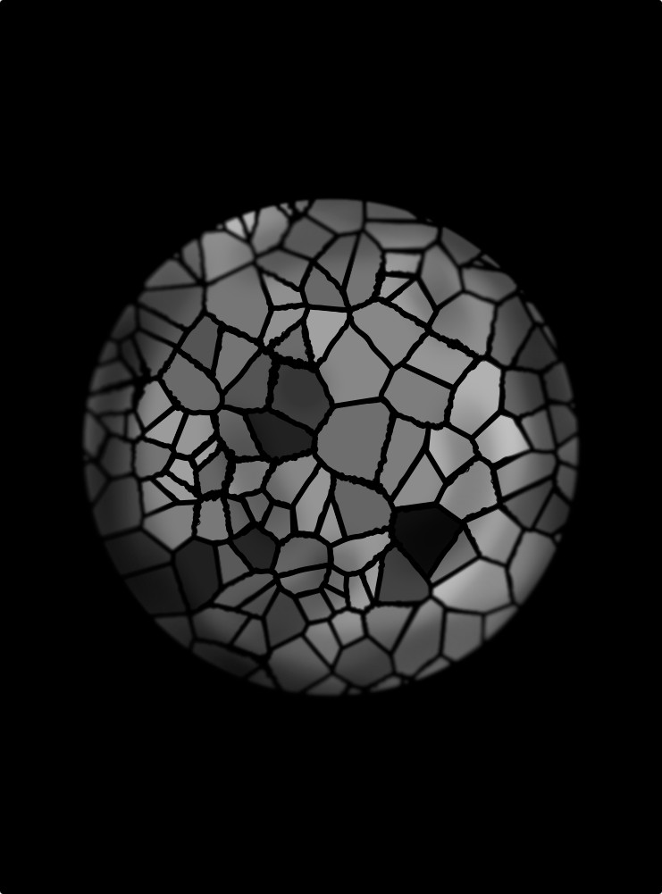
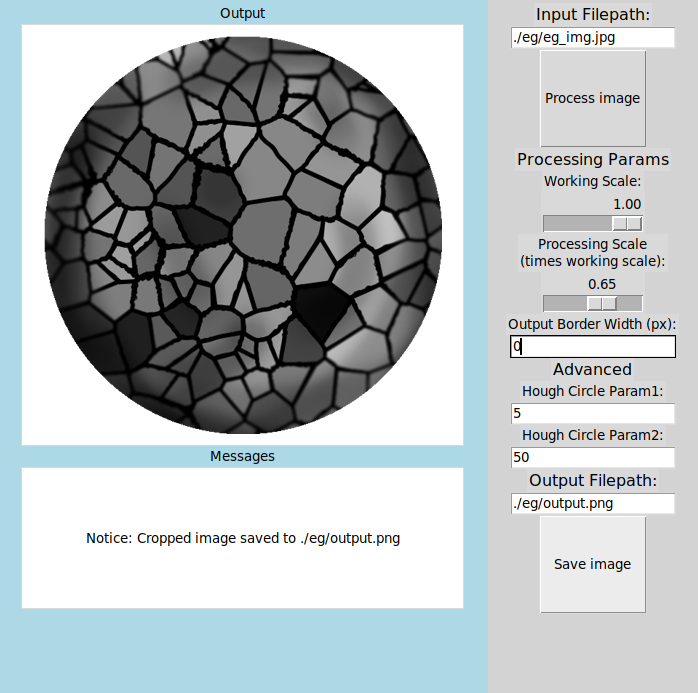
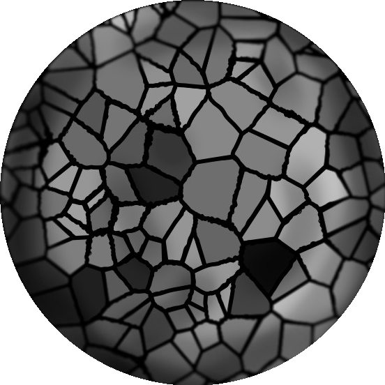

Crop images taken down a microscope to a circle using a Hough Circle Transform implemented by the `CV2` package.

# Usage
Run `crop_circle_gui.py`, which should bring up a GUI.

## Requirements

Output format must be `.png`.

## Dependencies
- tkinter
- PIL
- cv2
- numpy

## Limitations
- This method can be very slow for large images hence two downscales are applied, the first to reduce the image size permanently (i.e. applies to the output image as well), and the second to reduce this image's size before passing it to the (Hough) circle finding function.
- The cropped image, which is displayed as the output, may not always be accurately cropped - it may be necessary to change the parameters (e.g. increase one or both scales).
- The method may fail for certain types of images.
- The border width may not always be even throughout the cropped image.

# Example
Example using synthetic data created by the author using the Voronoi pattern generator in Inkscape and modified in GIMP:
<table>
<tr>
<th width="33%">Input image</th>
<th width="33%">Input parameters in gui</th>
<th width="33%">Output image</th>
</tr>
<tr>
<th></th>
<th></th>
<th></th>
</tr>
</table>

*Note: real data is not used here since there may be complications with regards to my usage rights of photos taken down microscopes not owned by me. Even if I took the photo, someone else maintains the microscope, so could it be argued that the photo was partially the result of their skill, judgement, effort etc. (e.g. in calibrating the microscope)?*
